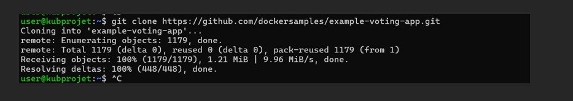
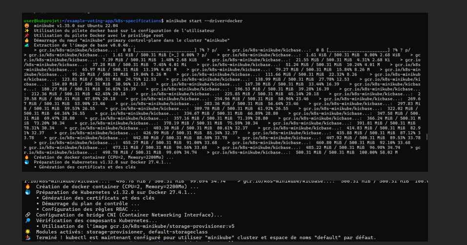

# Reverse Engineering – Déploiement & Design de l'Example Voting App

## Contexte

Une entreprise souhaite s'inspirer d'un code open source existant pour créer une application de vote améliorée. L'objectif est de faire fonctionner l'existant dans un cluster Kubernetes et de concevoir l'architecture des ressources et objets Kubernetes de cette application afin d'en comprendre les interactions et la structure.

## Objectifs

1. Déployer `example-voting-app` sur Kubernetes à l'aide des manifests fournis dans le dépôt GitHub.
2. Tester l'accès aux modules "vote" et "result" et s'assurer qu'après avoir renseigné un vote, le résultat est immédiatement disponible dans la page des résultats.
3. Créer un README explicite sur les étapes de déploiement et ajouter des captures d'écran des résultats obtenus.
4. Designer l'architecture des ressources et objets Kubernetes de cette application et illustrer l'interaction entre eux.

## Prérequis

- **MiniKube** : Assurez-vous que MiniKube est installé et que vous avez une instance de Kubernetes fonctionnelle.
- **Kubectl** : L'outil en ligne de commande pour interagir avec Kubernetes.
- **Git** : Pour cloner le dépôt GitHub.

Avant de commencer, vous devez installer **Docker** et **Minikube** sur votre machine.

###  Installer Docker

sudo apt update
sudo apt install -y docker.io
sudo systemctl enable --now docker
docker --version

###  Installer kubectl
curl -LO "https://dl.k8s.io/release/$(curl -s https://dl.k8s.io/release/stable.txt)/bin/linux/amd64/kubectl"
chmod +x kubectl
sudo mv kubectl /usr/local/bin/
kubectl version --client

## Étapes de Déploiement

. Cloner le dépôt GitHub

Clonez le dépôt contenant les fichiers nécessaires pour déployer l'application de vote.

git clone https://github.com/dockersamples/example-voting-app.git
cd example-voting-app

Installation et démarrage Minikube
sudo apt update
sudo apt install -y curl apt-transport-https virtualbox
curl -LO https://storage.googleapis.com/minikube/releases/latest/minikube-linux-amd64
sudo mv minikube-linux-amd64 /usr/local/bin/minikube

