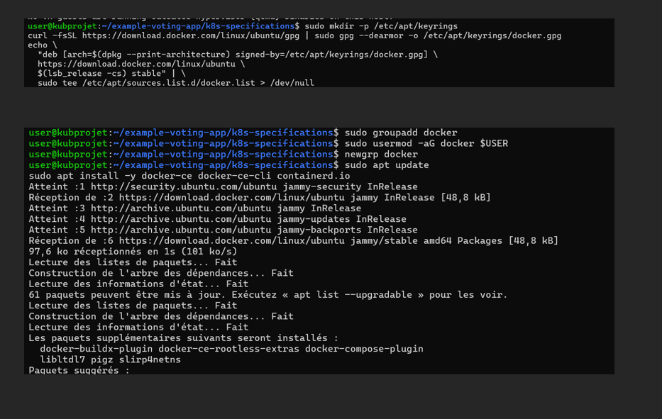
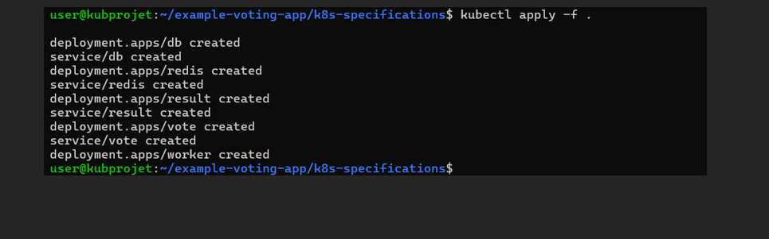
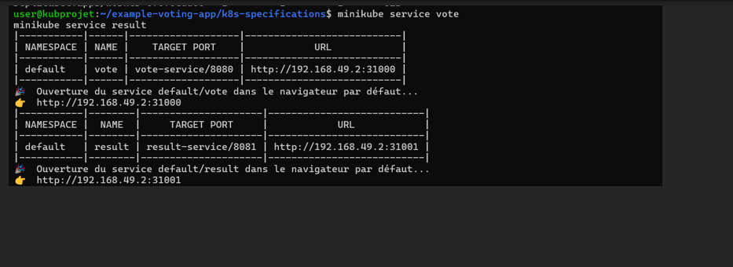
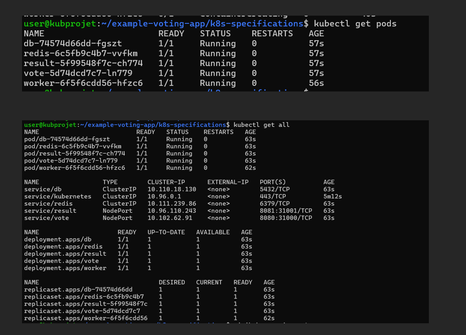
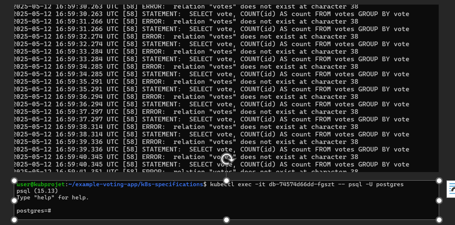
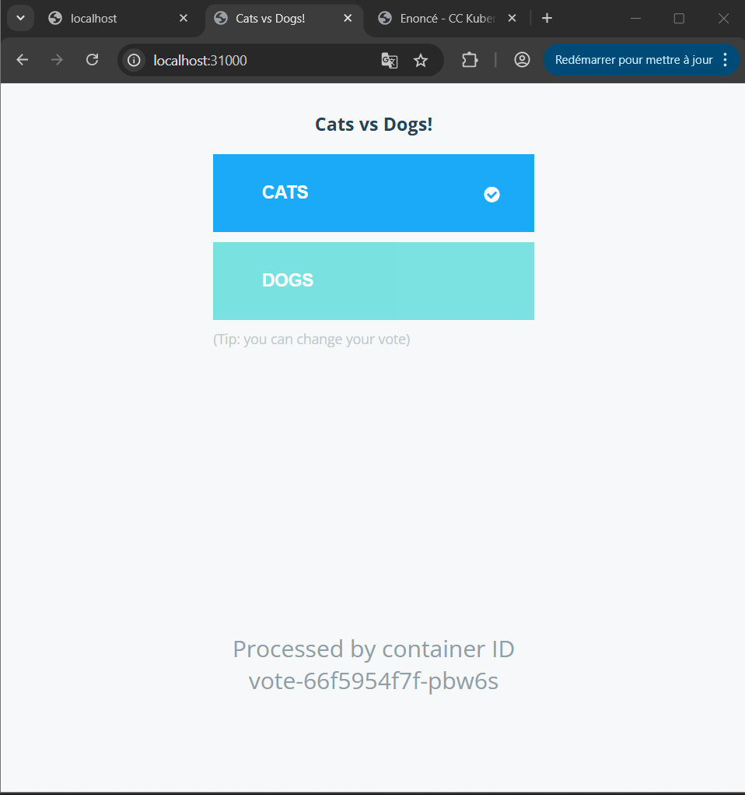

# Reverse Engineering – Déploiement & Design de l'Example Voting App

## Contexte

Une entreprise souhaite s'inspirer d'un code open source existant pour créer une application de vote améliorée. L'objectif est de faire fonctionner l'existant dans un cluster Kubernetes et de concevoir l'architecture des ressources et objets Kubernetes de cette application afin d'en comprendre les interactions et la structure.

## Objectifs

1. Déployer `example-voting-app` sur Kubernetes à l'aide des manifests fournis dans le dépôt GitHub.
2. Tester l'accès aux modules "vote" et "result" et s'assurer qu'après avoir renseigné un vote, le résultat est immédiatement disponible dans la page des résultats.
3. Créer un README explicite sur les étapes de déploiement et ajouter des captures d'écran des résultats obtenus.
4. Designer l'architecture des ressources et objets Kubernetes de cette application et illustrer l'interaction entre eux.

## Prérequis

- **MiniKube** : Assurez-vous que MiniKube est installé et que vous avez une instance de Kubernetes fonctionnelle.
- **Kubectl** : L'outil en ligne de commande pour interagir avec Kubernetes.
- **Git** : Pour cloner le dépôt GitHub.

Avant de commencer, vous devez installer **Docker** et **Minikube** sur votre machine.

###  Installer Docker

sudo apt update
sudo apt install -y docker.io
sudo systemctl enable --now docker
docker --version

✅ J'ai installé Docker manuellement sur Ubuntu avec sécurité : 

J'ai ajouté la clé GPG officielle de Docker. 

J'ai ajouté le dépôt Docker stable dans les sources APT. 

J'ai mis à jour les paquets (sudo apt update). 

Puis, j'ai installé Docker (docker-ce, docker-ce-cli, etc.). 

Et j'ai ajouté mon utilisateur au groupe Docker pour exécuter Docker sans sudo. 

Cela permet une installation propre et sécurisée. 

###  Installer kubectl
curl -LO "https://dl.k8s.io/release/$(curl -s https://dl.k8s.io/release/stable.txt)/bin/linux/amd64/kubectl"
chmod +x kubectl
sudo mv kubectl /usr/local/bin/
kubectl version --client

## Étapes de Déploiement

. Cloner le dépôt GitHub

Clonez le dépôt contenant les fichiers nécessaires pour déployer l'application de vote.

git clone https://github.com/dockersamples/example-voting-app.git 
cd example-voting-app 

Installation et démarrage Minikube
sudo apt update 
sudo apt install -y curl apt-transport-https virtualbox 
curl -LO https://storage.googleapis.com/minikube/releases/latest/minikube-linux-amd64 
sudo mv minikube-linux-amd64 /usr/local/bin/minikube 

Les commandes que j'ai exécutées ont déployé les différentes parties de l'application de vote dans mon cluster Kubernetes. Chaque "deployment" crée des pods pour chaque service (comme la base de données, Redis, le vote, etc.)

Les commandes minikube service vote et minikube service result ont ouvert les services vote et result dans le navigateur, vous permettant d'accéder à leurs interfaces via les URL respectives :

Pour le service vote : http://192.168.49.2:31000

Pour le service result : http://192.168.49.2:31001

Cela permet d'interagir avec l'application de vote et de voir les résultats en temps réel.

Les commandes kubectl get pods et kubectl get all montrent l'état actuel des ressources Kubernetes déployées.

Pods : Vous avez plusieurs pods qui sont en cours d'exécution et prêts, avec une disponibilité de 1/1, ce qui signifie qu'une seule instance de chaque pod fonctionne normalement.

Services : Les services tels que db, redis, result, et vote sont créés et accessibles.

Deployments et ReplicaSets : Ces objets gèrent le déploiement des applications, et chaque pod est associé à un ReplicaSet pour garantir sa disponibilité.

Les ressources sont bien déployées avec tous les services et pods en statut Running, ce qui signifie que l'application fonctionne correctement.

-L 31000:192.168.49.2:31000 : Redirige le port local 31000 vers le port 31000 de l'hôte 192.168.49.2.

-L 31001:192.168.49.2:31001 : Redirige également le port local 31001 vers le port 31001 de l'hôte 192.168.49.2.

user@192.168.24.141 : Connexion SSH à l'hôte distant avec l'adresse IP 192.168.24.141 en tant qu'utilisateur user.

ERREUR PLUSIEURS VOTES
Le problème vient probablement de la contrainte d'unicité sur l'id dans la table des votes, ce qui empêche d'enregistrer plusieurs votes du même utilisateur. Pour résoudre cela, il faut supprimer cette contrainte et s'assurer qu'un identifiant unique est attribué à chaque vote. Ensuite, plusieurs votes pourront être insérés pour le même utilisateur sans conflit.

SOLUTION
Supprimer la contrainte d'unicité sur id pour permettre des votes multiples du même utilisateur. Par exemple, si tu utilises une table votes(id, vote) et que id est unique, tu peux modifier cette contrainte :

sql
Copier
Modifier
ALTER TABLE votes DROP CONSTRAINT IF EXISTS votes_id_key;
Ajouter une nouvelle colonne d'identifiant unique pour chaque vote :

sql
Copier
Modifier
ALTER TABLE votes ADD COLUMN vote_id SERIAL PRIMARY KEY;
Insérer plusieurs votes sans erreur :
Une fois la contrainte d'unicité supprimée, tu peux insérer plusieurs votes :

sql
Copier
Modifier
INSERT INTO votes (id, vote) VALUES ('test123', 'a');
INSERT INTO votes (id, vote) VALUES ('test123', 'b');
Cela permettra à un utilisateur de voter plusieurs fois et d'enregistrer chaque vote séparément dans la base de données.

Une fois que les commandes sont validées et que les modifications sont appliquées, on peut désormais voter plusieurs fois

EXERCICE TERMINER
